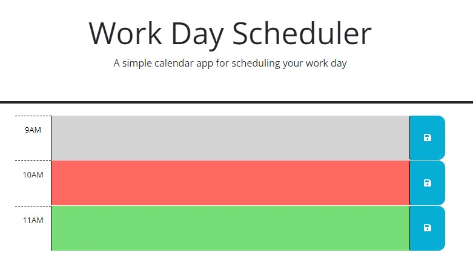

# 05-api-scheduler

## Work Day Scheduler

Using the Day.js (3rd Party) API and jQuery, the provided source code was refactored for the following functionality:

- current time displayed at the top
- timeblocks reflect standard business hours
- timeblocks are color coded (past= grey, present= red, future= green)
- timeblocks can have text entered
- the save button takes any text entered and adds to local storage
- the text entered is saved when the page is refreshed

As we learn about vanilla Javascript and jQuery, I'm leaning towards populating the html files using the script.js file however I know that once the complexity grows, the html file will need to be built out more. I like the practice of working in js to create for loops and if statements which is why I chose the practice opportunity for this repo.

[Work Day Scheduler](https://katievlasic.github.io/05-api-scheduler/)

